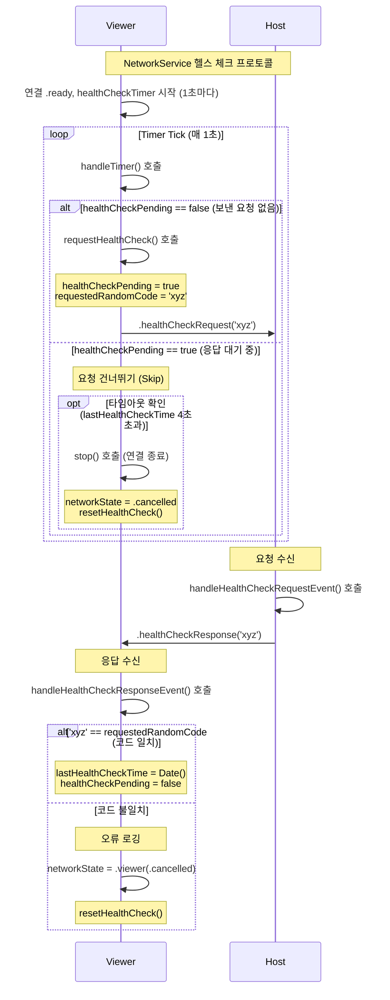

# 헬스 체크 매커니즘

- Viewer가 Host의 응답성을 확인하기 위해 주기적으로 실행하는 핑퐁 메커니즘
- Host(Publisher)는 Viewer가 연결을 끊었을 때 즉각 감지하기 때문에 뷰어에서 헬스 체크를 요청하도록 설계함

## 다이어그램

## 상세

1. 시작: Viewer가 Host와 .ready 상태가 되면, 1초마다 healthCheckTimer를 시작합니다.
2. 요청 (Viewer): 타이머가 울릴 때마다(handleTimer) Viewer는 healthCheckPending 플래그를 확인합니다.
  - false (응답 대기 중이 아님): true로 설정하고, 랜덤 코드를 생성하여 healthCheckRequest 이벤트를 Host에게 전송합니다.
  - true (응답 대기 중): 요청을 건너뛰고, 타임아웃을 확인합니다.
3. 응답 (Host): Host는 healthCheckRequest를 받으면(handleHealthCheckRequestEvent), 받은 코드를 그대로 healthCheckResponse 이벤트에 담아 Viewer에게 다시 보냅니다.
4. 검증 (Viewer): Viewer가 healthCheckResponse를 받으면(handleHealthCheckResponseEvent), 자신이 보냈던 코드와 일치하는지 확인합니다.
5. 일치: lastHealthCheckTime을 갱신하고 healthCheckPending을 false로 되돌려 다음 요청이 가능하도록 합니다.
  - 불일치: 연결 오류로 간주하고 networkState를 .cancelled로 변경하여 연결을 종료합니다.
  - 타임아웃 (Viewer): Viewer는 타이머가 울릴 때마다 마지막으로 응답받은 시간(lastHealthCheckTime)이 healthCheckTimeout(4.0초)을 넘겼는지 확인합니다.
6. 타임아웃 발생: Host가 응답이 없다고 판단하고 stop()을 호출하여 연결을 종료합니다.
