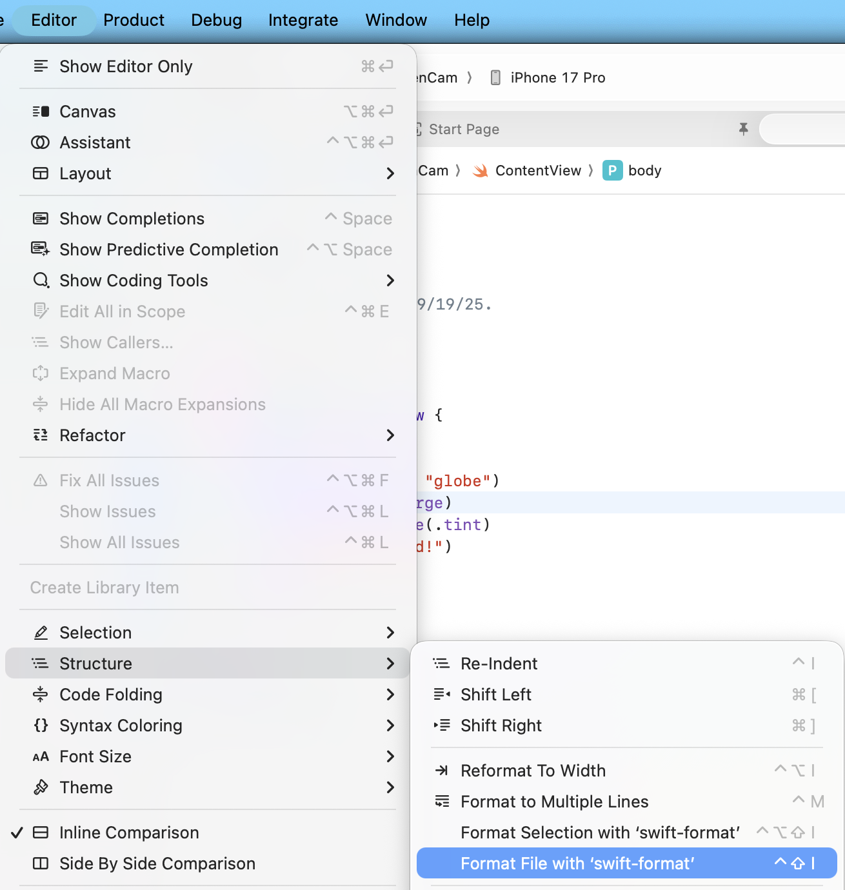

# QUEENDOM: 퀸의 재림

루크, 밥, 보타, 요시, 에린, 페퍼

## 개발 준비

### swift-format 설치

- 참고: [swift-format](https://github.com/swiftlang/swift-format)
- homebrew로 설치하면 간편합니다
    ```sh
    brew install swift-format
    ```

#### 사용 방법

- 특정 파일을 포매팅하고 싶을 때
    - Editor - Structure - Format File with 'swift-format' 또는 `컨트롤 + 쉬프트 + I`
        
- 모든 파일을 포매팅하고 싶을 때
    - 터미널로 QueenCam 디렉토리 이동 후, `swift-format . --recursive --in-place` 실행
    - 다만 내가 작업하지 않는 범위의 파일이 영향받지 않았는지 반드시 확인 후 푸시
